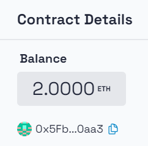
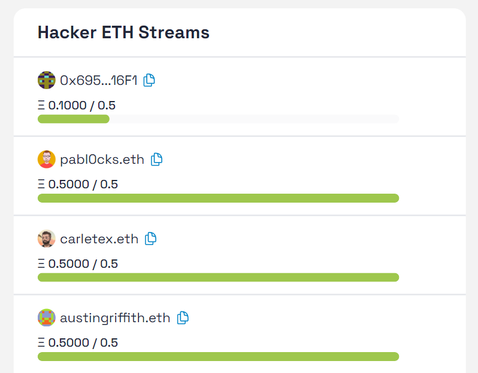
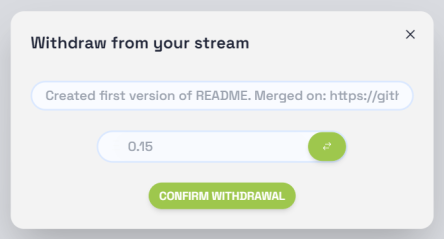
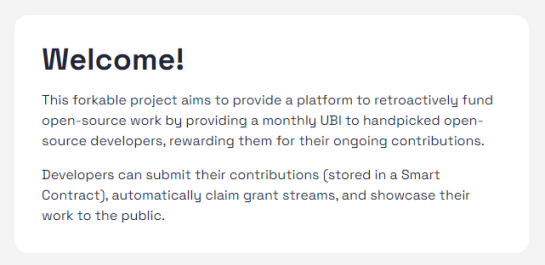
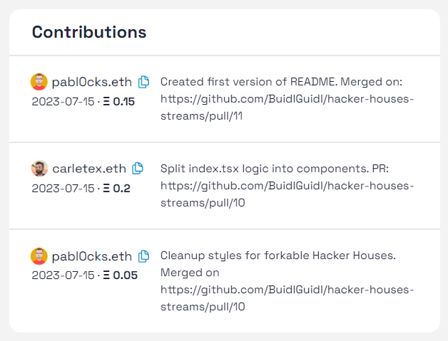
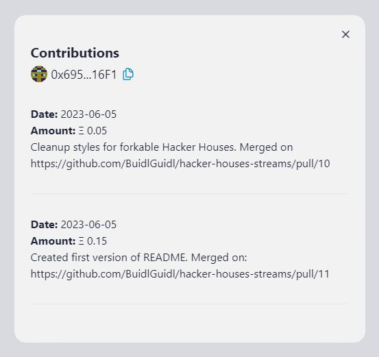

# Hacker Houses Streams

This **forkable** project aims to provide a platform to retroactively fund open-source work by providing a monthly
UBI to handpicked open-source developers, rewarding them for their ongoing contributions.

Developers can submit their contributions (stored in a Smart Contract), automatically claim grant streams, and showcase their work to the public.

**Stream mechanism:**

- Each developer has a stream with a monthly cap
- They can do partial or full withdrawals of their available stream when they make a contribution.
- After each withdrawal, their available stream gets recharged over the next 30 days.
- Once the stream is full, it stops recharging until the next withdrawal.

## Smart Contract features

We provide a contract that includes basic features for your Hacker House Stream.

- **Donations to the Hacker House**. Anyone can show their support to the Hacker House by sending ETH to the contract.



- **List of developers and their monthly stream cap**.



- **Withdrawals**. Each builder can do withdrawals from their available streams when they contribute.



- **Rechargeable streams**. After a withdrawal, the hacker's monthly stream gets recharged during the next 30 days, until reaching their cap (MAX monthly stream).


## Hacker House Website

You get a generic template to set your Hacker House Website. Feel free to add all the visual and copy changes to adapt it to your Hacker House. The template it's a one-page with:

- **Hacker House welcome**



- **List of hackers and their streams** (currently available and monthly cap)
- **List of contributions** (text submitted by developers for each withdrawal). In that text they can share links to their work (PR, Repo, design..)

  - **Full Hacker House contributions**

  

  - **Individual contribution detail**

  

Here you can view some examples of active Hacker Houses using this project:

| Hacker House         | Links                                                                                                                                     | Description                                                                                        |
| -------------------- | ----------------------------------------------------------------------------------------------------------------------------------------- | -------------------------------------------------------------------------------------------------- |
| Jessy's Hacker House | [Repo](https://github.com/BuidlGuidl/hacker-houses-streams/tree/jessy-streams-hacker-house) / [Site](https://hackerhouse.buidlguidl.com/) | One-page template with Jessy's Hacker House design touch                                           |
| Sand Garden          | [Repo](https://github.com/BuidlGuidl/hacker-houses-streams/tree/carlos-sand-garden) / [Site](http://sandgarden.buidlguidl.com/)           | Multi-page template, includes a Projects section with the list of the projects they are working on |

## Steps to set your own Hacker House

You'll need to complete a few steps to have your Hacker House running:

- [0. Checking prerequisites](#0-checking-prerequisites)
- [1. Clone/Fork this repo & install dependencies](#1-clonefork-this-repo--install-dependencies)
- [2. Configure contract data for your Hacker House Streams](#2-configure-contract-data-for-your-hacker-house-streams)
- [3. Configure website](#3-configure-website)
- [4. Testing locally](#4-testing-locally)
- [5. Deploy to a Live Network](#5-deploy-to-a-live-network)
  - [5.1 Deploy your Smart Contracts](#51-deploy-your-smart-contracts)
  - [5.2 Deploy your NextJS App](#52-deploy-your-nextjs-app)
  - [5.3 Disabling type and linting error checks](#53-disabling-type-and-linting-error-checks)

### 0. Checking prerequisites

This project is powered by [Scaffold-ETH 2](https://github.com/scaffold-eth/scaffold-eth-2). Before you begin, make sure you meet its requirements:

- [Node (v18 LTS)](https://nodejs.org/en/download/)
- Yarn ([v1](https://classic.yarnpkg.com/en/docs/install/) or [v2+](https://yarnpkg.com/getting-started/install))
- [Git](https://git-scm.com/downloads)

### 1. Clone/Fork this repo & install dependencies

```shell
git clone https://github.com/buidlguidl/hacker-houses-streams.git
cd hacker-houses-streams
yarn install
```

### 2. Configure contract data for your Hacker House Streams

- Paste your builder's addresses into `builderList.ts`.

  ```jsx
  const builderList = [
    "0x34aA3F359A9D614239015126635CE7732c18fDF3",
    "0x60583563d5879c2e59973e5718c7de2147971807",
  ];
  ```

  > **Note:** Add the Ethereum Address `0x...`, ENS names will get resolved at the front-end.

- Check the contract deploy script in `packages/hardhat/deploy/00_deploy_your_contract.ts`.

  - Adapt monthly stream for each builder.

    ```jsx
    const builderStakes = Array(builderList.length).fill("500000000000000000");
    ```

  - Transfer ownership from the contract to the Leader of the Hacker House.

    ```jsx
    console.log("🏷 handing ownership over to atg.eth");
    await yourContract.transferOwnership(
      "0x34aA3F359A9D614239015126635CE7732c18fDF3"
    );
    ```

### 3. Configure website

- Adapt generic template copy & metadata on `packages/nextjs/pages/index.tsx`.
- Customize Look and Feel for each component. We are using Tailwind and daisyUI.
  - `packages/nextjs/tailwind.config.js` (You can play with the colors here)

### 4. Testing locally

1. Run the hardhat local node

   ```shell
   yarn chain
   ```

This command starts a local network using Hardhat. The network runs on your local machine and can be used for testing and development. You can customize the network configuration in `hardhat.config.js`.

2. On a second terminal, deploy the test contract:

   ```shell
   yarn deploy
   ```

This command deploys a test smart contract to the local network. The contract is located in `packages/hardhat/contracts` and can be modified to suit your needs. The `yarn deploy` command uses the deploy script located in `packages/hardhat/deploy` to deploy the contract to the network.

3. In a third terminal, start your NextJS app:

   ```shell
   yarn start
   ```

Visit your app on: `http://localhost:3000`.

### 5. Deploy to a Live Network

#### 5.1 Deploy your Smart Contracts

Once you are ready to deploy your smart contract, there are a few things you need to adjust.

1. Generate a new deployer account

`yarn generate` will create a random account and will add the DEPLOYER_PRIVATE_KEY to the .env file.
You can check the generated account with `yarn account`.

You could also use an existing account by adding the private key to the .env file.

2. Deploy your smart contract to the selected the network

By default, `yarn deploy `will deploy the contract to the local network. To deploy to a different network, run:

```shell
yarn deploy --network target_network
```

Check the `hardhat.config.js` for the networks that are pre-configured.
You can also add other networks on the `hardhat.config.js` file.

Example: To deploy the contract to the Sepolia network, run the command below:

```shell
yarn deploy --network sepolia
```

3. Verify your smart contract

You can verify your smart contract on Etherscan by running:

```shell
yarn verify --network target_network
```

#### 5.2 Deploy your NextJS App

In the nextjs folder, copy `.env.example` to `.env.local` and set `NEXT_PUBLIC_DEPLOY_BLOCK` to the block number where the contract was deployed (it optimizes the reading of events). Make sure to add that ENVAR to your Vercel project as well.

Run `yarn vercel` and follow the steps to deploy to Vercel. Once you log in (email, github, etc), the default options should work. It'll give you a public URL.

If you want to redeploy to the same production URL you can run `yarn vercel --prod`. If you omit the `--prod` flag it will deploy it to a preview/test URL.

**Make sure your `packages/nextjs/scaffold.config.ts` file has the values you need.**

**Hint**: We recommend connecting the project GitHub repo to Vercel so you the gets automatically deployed when pushing to `main`

#### 5.3 Disabling type and linting error checks

> **Hint**
> Typescript helps you catch errors at compile time, which can save time and improve code quality, but can be challenging for those who are new to the language or who are used to the more dynamic nature of JavaScript. Below are the steps to disable type & lint check at different levels

##### Disabling commit checks

We run `pre-commit` [git hook](https://git-scm.com/book/en/v2/Customizing-Git-Git-Hooks) which lints the staged files and don't let you commit if there is an linting error.

To disable this, go to `.husky/pre-commit` file and comment out `yarn lint-staged --verbose`

```diff
- yarn lint-staged --verbose
+ # yarn lint-staged --verbose
```

##### Deploying to Vercel without any checks

Vercel by default runs types and lint checks while developing `build` and deployment fails if there is a types or lint error.

To ignore types and lint error checks while deploying, use :

```shell
yarn vercel:yolo
```

##### Disabling Github Workflow

We have github workflow setup checkout `.github/workflows/lint.yaml` which runs types and lint error checks every time code is **pushed** to `main` branch or **pull request** is made to `main` branch

To disable it, **delete `.github` directory**
